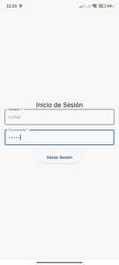
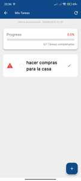
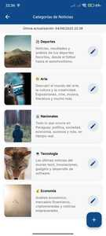
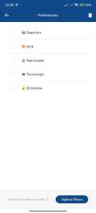
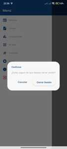

# vdenis-flutter001

Aplicación desarrollada como parte del Bootcamp de Flutter de Sodep (2025). Implementa un sistema completo de tipo CRUD (Crear, Leer, Actualizar, Eliminar), utilizando Dio para la comunicación HTTP y Bloc como patrón de gestión de estado.

## Entorno de desarrollo

Estas son las versiones utilizadas en el desarrollo para asegurar compatibilidad:

- **Flutter**: 3.29.3  
- **Dart**: 3.7.2  
- **Android SDK**: 35.0.1  

> Puedes verificar tu entorno local ejecutando:  
> `flutter --version`

## Configuración de Variables de Entorno

Para ejecutar la aplicación correctamente, es necesario definir variables de entorno en un archivo `.env`. Sigue estos pasos para configurarlo:

1.Duplicar el archivo .env.example

```bash
cp .env.example .env
```

2.Editar las variables según tu entorno en .env

3.Guarda el archivo para que la aplicación pueda leer estas variables al iniciar.

## Ejecución del Proyecto

### Dependencias del sistema (Linux)

Si estás en Linux y planeas correr el proyecto con soporte de `flutter_secure_storage`, necesitas instalar la siguiente dependencia del sistema:

```bash
sudo apt install libsecret-1-dev
```

Sigue estos pasos para configurar y ejecutar el proyecto localmente:

```bash
# 1. Clonar repositorio
git clone https://github.com/virden18/vdenis-flutter001
cd vdenis-flutter001

# 2. Limpiar el proyecto 
flutter clean

# 3. Instalar dependencias
flutter pub get

# 4. Ejecutar (usar tu dispositivo conectado o emulador)
flutter run
```

## Capturas de pantalla









